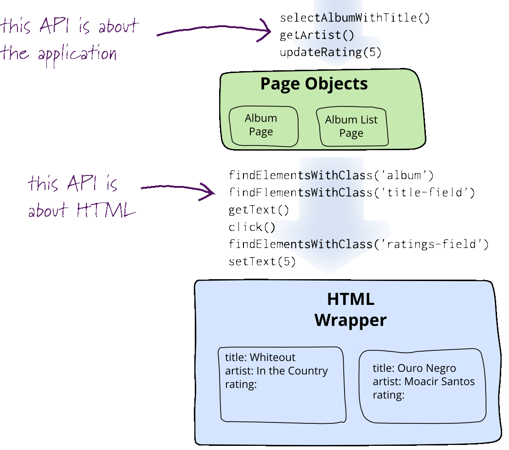

## Overview

Recently, I made a poll on what would be my next blog post topic, and a lot of my network is interested in what I view as major reasons that most QA Automation endeavors fail. Given that I spent a significant amount of my time in my early career doing SDET work, as well as beginning to develop an understanding the benefit of having a DevOps based culture within IT organizations, this post will discuss my conclusions as to what I feel makes for a failed automation effort.

Some of my talking points will be very biased, and may be unpopular opinions in the QA world. However, although something may be unpopular, doesn't necessarily mean it's incorrect. With that being said, these are what I feel are some of the main reasons why most QA automation fails.

## Automation team is siloed from the development team

Sin number one, the QA / QA Automation team works in a silo, with little to no visibility in regards to what is happening within their Sprint.

From an automation development perspective, this makes understanding what changes are going to break my existing tests EXTREMELY cumbersome. More often than not, teams that work in a silo wait until development is complete to realize their  automation is crumbling because a developer completely reworked how that view functions within the application under test.

Furthermore, when an automation team detaches themselves from development, they lose insight as to how they can make their tests more efficient when building out their test scenarios, views, hooks, services, etc.

My best advice for those that are doing UI / Service Automation; integrate yourself with the team in which you're building those tests for. Be a part of their sprint, as well as ensure capacity is accounted for automation based work. A proactive approach is much better than a reactive approach.

## Only using Page Object Model pattern

This particular sin is one that personally bothers me anytime I am reviewing a framework. 

While the page object model is a very good way of structuring our UI testing views, this shouldn't be the only pattern we need to rely on when architecting our automation framework. For example, there are many cases when we need to specify different behavior for different users, handling the creation of different web driver instances (e.g., Firefox, Chrome, etc), or maybe even creating small extensions to interface directly with APIs, databases, etc for data preparation and teardown. 

Pigeonholing yourself into one pattern will not only cripple your automation, but will lead to extensive amounts of boiler plate as you are implementing functionality needed from your framework only at the UI level, where the cases I just listed become borderline impossible to address.

Typically when I see a framework only using this pattern, this is a tell tale sign that the automation engineer implementing said framework has very poor understanding of the programming language they are utilizing. 

My recommendation for those falling victim to this particular automation sin is to engage in more professional development around design patterns, programming fundamentals, etc. 

There are actually two books I recommend that will help a lot: **Clean Code by Robert C Martin** and **Design Patterns: Elements of Reusable Object-Oriented Software by the "gang of four"**.

## Attempting to automate everything

Last but not least, the ultimate sin of any automation implementation: **attempting to automate everything**.

This is to the contrary of what we typically say in DevOps: automate anything and everything. However, in the QA world, this is not always the case.

In fact, rather than thinking of *"How can I automate all my regression?"*... we should rather ask the question ***What part of my regression is considered critical path for the business? What tests, at the end of the day, really fall in line of the customer experience?***

When you ask yourself this question, it can save you a lot of time (both implementation and execution) for your overall automation effort. I have seen throughout my career many cases where folks will add redundancy to the automation suite that were either a result of exploratory tests, an edge case in production, or a one time bug that is being retested for no reason.

We should also remember the place of integration / UI tests within our testing lifecycle by revisiting the testing pyramid:

In our overall testing cycle, UI and Integration (service) tests are only but a fraction of our overall testing effort. In any development team, unit tests **SHOULD** be a majority of our regression.

tldr: at the black box level, automate only the things that matter.

## Conclusion

Overall, my general view of automation encompasses collaboration with the dev team (aka you are a dev writing automation), well written code, zero redundancy, scalability, and prioritization of business critical path. 

Hopefully those of you who are looking into getting into the world of QA or are already working in a QA related function developed some insights as to what we should avoid while implementing our automation. 

I may make another post demonstrating an example of a well defined framework structure, as well as neat tips and tricks to optimize regression time. 😊